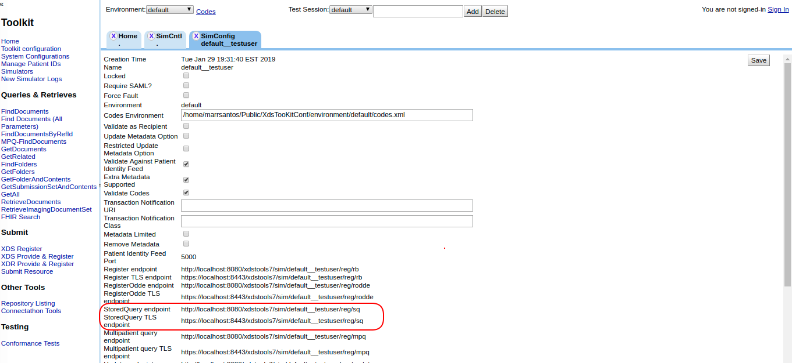

## Test #5003

FindDocuments Stored Query and generic instructions for testing Document Consumer implementations of Stored Queries.

**References:** ITI TF-2 3.18

**Actor:** Document Consumer

**Resources:** NIST XDS ToolKit

In these test cases, the NIST XDS Tookit acts as a simulator for an XDS.b Document Repository and Document Registry.  This enables an XDS.b Document Source to submit documents to Toolkits, and an XDS.b Document Consumer to query for and retrieve documents.

You must install Toolkit locally before performing these tests.   The XDS Toolkit download and instructions are found here:  https://github.com/usnistgov/iheos-toolkit2/wiki/Toolkit

**Test Procedure**  

1. Use same patient ID used for Test #5001.  

2. Double click on the new Registry simulator (created in the Step 3# of test #5001) and take note of the Stored Query endpoint.

 

3. Use your System Under Test (actor: document consumer) to submit a “FindDocument” Stored Query retrieving all documents for the patient ID against the Store Query endpoint (Step #2).

4. Go to the “Simulators” menu option. Select your registry simulator, click on the “log” action (similar to step 10 of test #5001).  

5. Select the “message” you have just generated. Take a screenshot of this screeen and click on the “Download message” option (similar to step 11 of test #5001).  

6. Post the generated zip file and screenshot to Gazelle Action “return log file”.  

