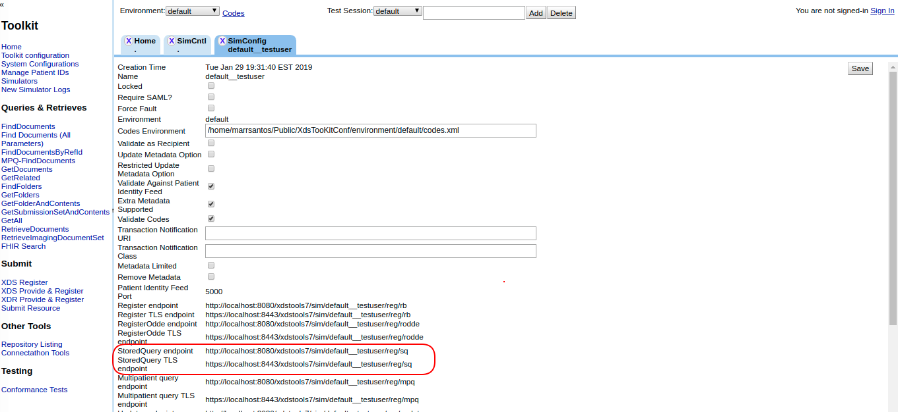

## Test #5001
Submit one document via XDS.b

Verify that the XDS.b Document Source can submit a single document via Provide and Register Document Set-b transaction. 

**References:** ITI TF-2 3.41

**Actor:** Document Source

**Dependencies:** None

**Resources:** NIST XDS ToolKit

**Test Procedure**  

1. Access NIST XDS Toolkit and enter with the admin password (default: "easy")

2. Create a test session or select a proper one. Check if the "default" environment codes is being used.  

3. Go to the “Simulators” menu option. Select "Document Registry" for actor type. Enter with a shortname for your simulator, and click on "Create Actor Simulator" bottom. 

4. Double click on the new Register simulator and take note of the register endpoint.

5. Repeat Step #3 for creating a "Document Repository" simulator. Give it a different shortname.

6. Double click on the new Repository simulator, configure the Registry endpoint (that you have taken note on Step #4) and click on "Save".

7. Go to the “Manage Patient IDs” menu option. Select one patient ID, select your register simulator and click on “Run” bottom to send a patient feed transaction to your register simulator  

8. Go to "Simulators" menu option. Open the Repository simulator you created in the Step #5 and take note of the Repository endpoints. 

9. Use your System Under Test (actor: document source) to submit a Submission Set containing a single Document using the Provide and Register Document Set-b transaction against the Pnr endpoint (or Pnr TLS endpoint).   

10. Go to the “Simulators” menu option. Open the Repository simulator and click on the “log” action  

11. Select the “message” you have just generated. Take a screenshot and click on the “Download message” option.

  

12. Post the generated zip file and screenshot to Gazelle Action “return log file”.  

## Test #5002
Submit one document via XDS.b over TLS

Verify that the XDS.b Document Source can submit a single document via Provide and Register Document Set-b transaction over TLS. 

**References:** ITI TF-2 3.41

**Actor:** Document Source

**Resources:** NIST XDS ToolKit

**Test Procedure**

Repeat all steps of test 12049. However, perform Step #9 over TLS.

## Test #5003
FindDocuments Stored Query and generic instructions for testing Document Consumer implementations of Stored Queries.

**References:** ITI TF-2 3.18

**Actor:** Document Consumer

**Resources:** NIST XDS ToolKit

**Test Procedure**  

1. Use same patient ID used for Test 12049.  

2. Double click on the new Registry simulator (created in the Step 3# of test 12049) and take note of the Stored Query endpoint.

 

3. Use your System Under Test (actor: document consumer) to submit a “FindDocument” Stored Query retrieving all documents for the patient ID against the Store Query endpoint (Step #2).

4. Go to the “Simulators” menu option. Select your registry simulator, click on the “log” action (similar to step 10 of test 12049).  

5. Select the “message” you have just generated. Take a screenshot of this screeen and click on the “Download message” option (similar to step 11 of test 12049).  

6. Post the generated zip file and screenshot to Gazelle Action “return log file”.  

