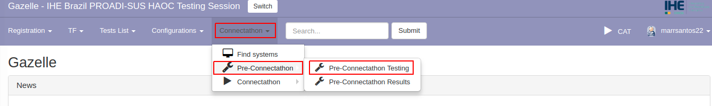
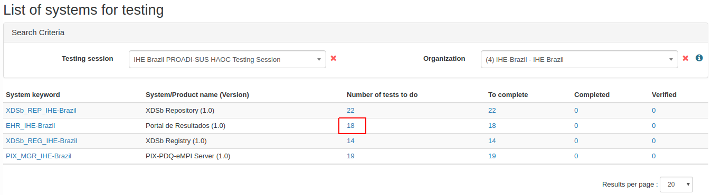
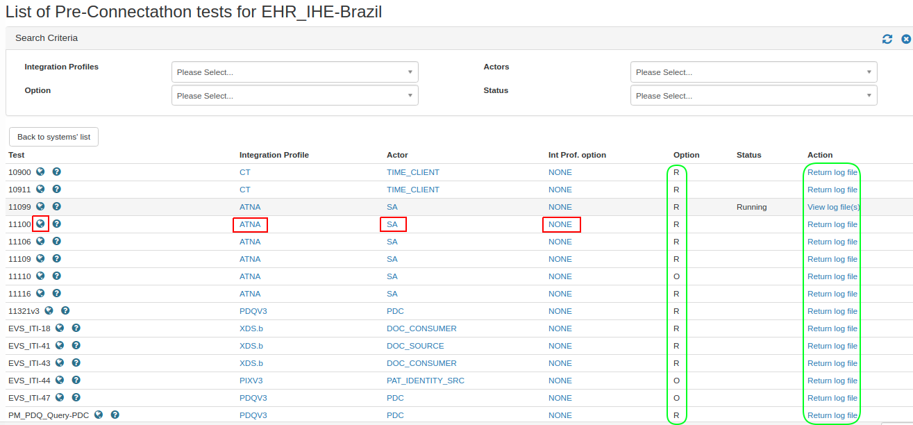
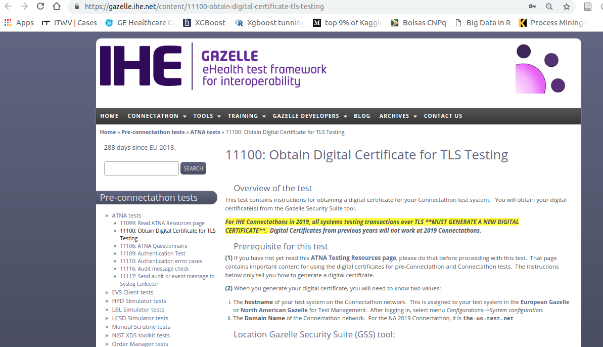
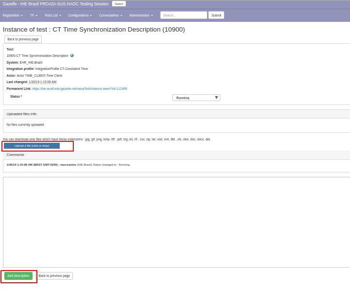

### Instrução para acesso aos testes pré-connectathon

Acesso o [sistema Gazelle](https://ihe.wustl.edu/gazelle-na/) com o seu usuário

Selecione o menu Connectathon opção pre-connectathon / pre-connectathon

Visualize os sistemas cadastrados para sua organização e os testes sugeridos para cada um deles.

Clique no número de testes a realizar (number of tests to do) para visualizar a lista de testes que correspondem às combinações de perfil/ator/opção registrada para o sistema em análise.

A coluna "Option" indica se o teste é obrigatório (R) ou opcional (O). Você pode optar também por utilizar o filtro por "Option" e ver apenas os obrigatórios. Clique no perfil/ator/opção para ver a documentação relacionada com estes itens. 

Clique no "globo" para acessar instruções sobre o teste.

Volte na página com a lista de testes a executar. A coluna "Action" permite acessar a instância de teste e fazer upload de arquivos com resultados ou inserir comentários gerais sobre os testes realizados.

